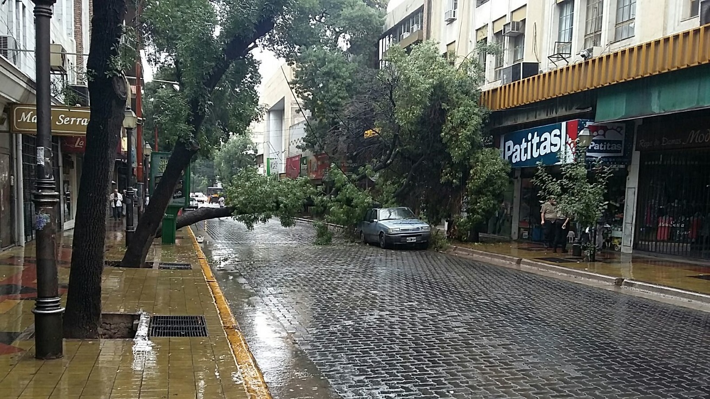
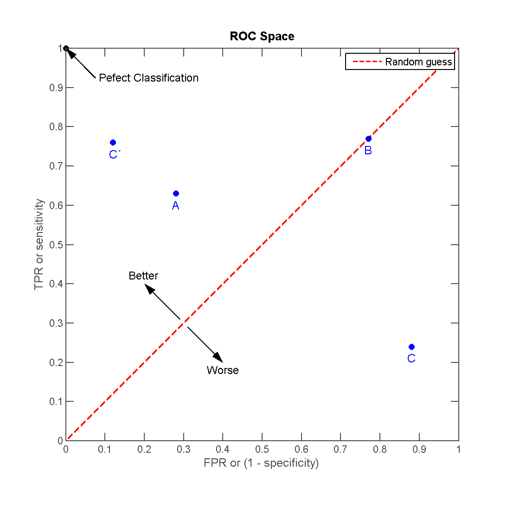

```{r setup}
knitr::opts_chunk$set(include = FALSE)
library(dplyr)
library(caret)
```

```{r, include=FALSE}
## Generación de los archivos para el desafío

load("~/data/arboladomendoza.rda")

data_arbolado<-data_arbolado %>% select(id,especie,ultima_modificacion,altura,circ_tronco_cm,diametro_tronco,long,lat,seccion,nombre_seccion,area_seccion,inclinacion_grave)

names(data_arbolado)[12]<-"inclinacion_peligrosa"
data_arbolado<- data_arbolado %>% mutate(inclinacion_peligrosa=ifelse(inclinacion_peligrosa=="si",1,0))
set.seed(301)
trainset<-data_arbolado
trainIndex <- createDataPartition(trainset$inclinacion_peligrosa, p=0.70, list=FALSE)
data_train <- trainset[ trainIndex,]
data_test <-  trainset[-trainIndex,]
sample_solution<-data_test %>% select(id,inclinacion_peligrosa) 
sample_solution$inclinacion_peligrosa<-sample(c(0,1),nrow(data_test),replace=TRUE)
## Agregamos informacion del cluster
#data_train<-cbind(data_train,cluster=data_arbolado_cluster[trainIndex,]$cluster)
#data_test <-cbind(data_test,cluster=data_arbolado_cluster[-trainIndex,]$cluster)
readr::write_csv(data_train,"./arbolado-mza-dataset.csv")
readr::write_csv(sample_solution,"./arbolado-mza-dataset-sample-solution.csv")
readr::write_csv(data_test[,-12],"./arbolado-mza-dataset-test.csv")
readr::write_csv(data_test[,c(1,12)],"./arbolado-mza-dataset-solutions.csv")
data_test %>% group_by(inclinacion_peligrosa) %>% summarise(n=n())
data_arbolado<-data_train
data_arbolado
data_train[2586,]
```

#HACKATON AM 2017
 


## Descripcion 

El siguiente desafío surge como propuesta dentro de la *Cátedra de Aprendizaje de Maquinas(AM)* de la Universidad Tecnológica Nacional Facultad Regional Mendoza, el laboratorio **DHARMA** y el **ITIC** de la Universidad Nacional de Cuyo. 

La actividad está fundamentalmente orientada a los estudiantes de la materia optativa, sin embargo se invita a participar a todo aquel interesado.

**¿Se puede predecir el grado de peligrosidad de una árbol dada sus características?**

La Secretaría de Ambiente y Desarrollo Sustentable de la Ciudad de Mendoza, Argentina; destaca a la cultura del árbol tanto como patrimonio cultural y como un aliado indispensable del progreso y el desarrollo de la vida en la provincia de Mendoza. Sin embargo, todos sabemos del peligro que suponen los árboles durante las temporadas de fuertes tormentas y sobre todo la época de viento Zonda. El grado de inclinación de un árbol es un factor fundamental a tener en cuenta a la hora de prevenir los posibles accidentes ocasionados por los fenómenos meteorológicos severos a los que muchas veces está sujeta la provincia de Mendoza.

El **objetivo** detras del presente desafío es el de predecir aquellos especímenes que tengan un grado de inclinación peligroso (i.e. mayor a 30 grados) a partir de sus caracteristcas biológicas e información geográfica/administrativa. Para tal fin se cuenta con un conjunto de datos que contiene el censo georeferenciado del arbolado público en la ciudad de Mendoza al año 2012. 

## Habilidades:

Se espera que durante el desarrollo de esta actividad el participante aprenda a:

1. Lidiar con conjuntos de datos reales

2. Trabajar sobre conjuntos de datos con clases no balanceadas
    + Aprender o reforzar nuevas métricas para evaluar los resultados obtenidos
    + Aprender técnicas de muestreo

3. Experimentar con el ajuste fino de algoritmos de aprendizaje 

4. Proponer nuevas técnicas/estrategias para mejorar los algoritmos

5. Trabajar en Equipo


## Conjunto de Datos

Los datos fueron generados a partir del Censo digital georeferenciado del arbolado público de la Ciudad de Mendoza, realizado en el año 2012. Mediante el mismo se permitió registrar de cada forestal una serie de datos que permiten definir su ubicación de un modo más preciso, actualizar la información en forma permanente y, sobre todo, planificar acciones futuras. El archivo original forma parte del del programa de *Datos Abierto de la Ciudad de Mendoza* 

Del archivo original se eliminaron los registros sin información y se agregó información relativa a los límites administrativos de la ciudad de Mendoza. Por último se crea la clase *inclinacion_peligrosa* donde se indica si la inclinación del árbol se encuentra bajo una situación de gravedad (o no).

###Descripción de los Archivos

* **[arbolado-mza-dataset.csv](https://www.dropbox.com/s/5a0u4h55qnvklhl/arbolado-mza-dataset.csv?dl=1)** - conjunto de datos para entrenamiento
* **[arbolado-mza-dataset-test.csv](https://www.dropbox.com/s/v6nmg1ny47kj9du/arbolado-mza-dataset-test.csv?dl=1)** - conjunto de datos para evaluación
* **[arbolado-mza-dataset-envio-ejemplo-rpart.csv]()** - Ejemplo del formato para realizar envíos usando árboles de decisión rpart
* **[arbolado-mza-dataset-descripcion.csv](https://www.dropbox.com/s/qvf0frk1ejpu476/arbolado-mza-dataset-descripcion.csv?dl=1)** - Información extra sobre los datos.


###Campos

* *id* - (integer) - Identificación
* *especie-* (integer) - Especie del Forestal (arbol)
* *ultima_modificacion* - (character) - Fecha de la última modificación del registro
* *altura* - (integer) - Altura del Forestal
* *circ_tronco_cm* - (double) - Circunferencia del Tronco del Forestal
* *diametro_tronco* - (character) - Diámetro del Tronco del Forestal
* *long* - (double) - Longitud (Posición Geográfica)
* *lat* (double) - Latitud (Posición Geográfica)
* *seccion* - (integer) - Número de Sección Administrativa a la que pertenece el Forestal
* *nombre_seccion* - (character) - Nombre de la Sección Administrativa
* *area_seccion* - (double) - Area de la Sección Administrativa, en Km2
* **inclinacion_peligrosa** - (integer) - Clase: Inclinación grave

## Evaluacion
Dado el alto nivel de desbalanceo de las clases, hará esta competencia vamos a usar la métrica ** ROC (Area Under de Curve)**.

**(De Wikipedia)** 

Para dibujar una curva ROC sólo son necesarias las razones de Verdaderos Positivos (VPR) y de falsos positivos (FPR). La VPR mide hasta qué punto un clasificador es capaz de detectar o clasificar los casos positivos correctamente, de entre todos los casos positivos disponibles durante la prueba. La FPR define cuántos resultados positivos son incorrectos de entre todos los casos negativos disponibles durante la prueba.

Un espacio ROC se define por FPR y VPR como ejes x e y respectivamente, y representa los intercambios entre verdaderos positivos (en principio, beneficios) y falsos positivos (en principio, costes). Dado que VPR es equivalente a sensibilidad y FPR es igual a 1-especificidad, el gráfico ROC también es conocido como la representación de sensibilidad frente a (1-especificidad). Cada resultado de predicción o instancia de la matriz de confusión representa un punto en el espacio ROC.

 

El mejor método posible de predicción se situaría en un punto en la esquina superior izquierda, o coordenada (0,1) del espacio ROC, representando un 100% de sensibilidad (ningún falso negativo) y un 100% también de especificidad (ningún falso positivo). A este punto (0,1) también se le llama una clasificación perfecta. Por el contrario, una clasificación totalmente aleatoria (o adivinación aleatoria) daría un punto a lo largo de la línea diagonal, que se llama también línea de no-discriminación, desde el extremo inferior izquierdo hasta la esquina superior derecha (independientemente de los tipos de base positivas y negativas). Un ejemplo típico de adivinación aleatoria sería decidir a partir de los resultados de lanzar una moneda al aire, a medida que el tamaño de la muestra aumenta, el punto de un clasificador aleatorio de ROC se desplazará hacia la posición (0.5, 0.5).

La diagonal divide el espacio ROC. Los puntos por encima de la diagonal representan los buenos resultados de clasificación (mejor que el azar), puntos por debajo de la línea de los resultados pobres (peor que al azar). Nótese que la salida de un predictor consistentemente pobre simplemente podría ser invertida para obtener un buen predictor.

Se recurre a las curvas ROC, ya que es una medida global e independiente del punto de corte. La elección se realiza mediante la comparación del área bajo la curva (AUC) de ambas pruebas. Esta área posee un valor comprendido entre 0,5 y 1, donde 1 representa un valor diagnóstico perfecto y 0,5 es una prueba sin capacidad discriminatoria diagnóstica. Es decir, si AUC para una prueba diagnóstica es 0,8 significa que existe un 80% de probabilidad de que el diagnóstico realizado a un enfermo sea más correcto que el de una persona sana escogida al azar. Por esto, siempre se elige la prueba diagnóstica que presente una mayor área bajo la curva.

### Formato para el envio de soluciones

*Por cada Forestal/árbol* en el conjunto de datos de evaluación, los archivos debe contener dos columnas, **ID** y **inclinación_peligrosa.** 

**El archivo debe contener una cabecera en el siguiente formato:**
```
ID,inclinacion_peligrosa
1,si
12,no
13,no
122,si
1356,no
etc.

```

## Material Extra

###Videos:

[¿Que es la Ciencia de Datos?](https://www.youtube.com/watch?v=rNDwXp2OHp8) Duración (15min)

Video que explica las herramientas y las técnicas utilizadas en lo que se conoce como Ciencias de Datos


[¿Cual es la Metodología de la Ciencia de Datos ?](https://www.youtube.com/watch?v=2Zrk4H43J0k) Duración (10min)

Video que detalla la metodología a seguir para aplicar las diferentes herramientas de la llamada Ciencia de Datos

**Informacion sobre KAGGLE**

[Como funciona Kaggle?](https://www.youtube.com/watch?v=0CBV_aDcXa8) (5 Mins)

Que es Kaggle, para qué sirve y por qué lo vamos a usar para gestionar este desafio

[Explorando el sitio del desafio en Kaggle](https://www.youtube.com/watch?v=wHh-iswUMLE) (5 Mins)

Como acceder al sitio con el desafio y que vamos a encontar en él.

[Hacer un envio al sitio del desafio](https://www.youtube.com/watch?v=YshAeSdF2h0&t=3s) Duracion (1.5 Mins)

Como hacer un envío con las predicciones de nuestro modelo. La tabla de resultados.

## Agradecimientos

Gracias al programa [Open Data](http://datos.ciudaddemendoza.gov.ar/) de la Ciudad de Mendoza, Argentina


